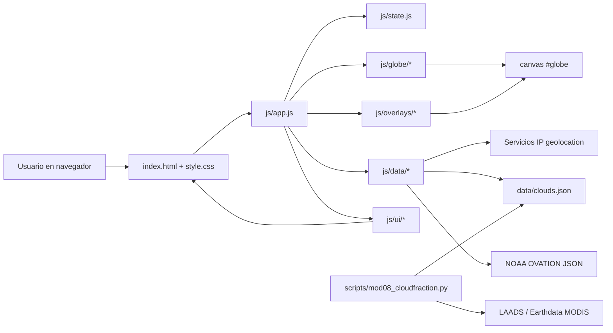
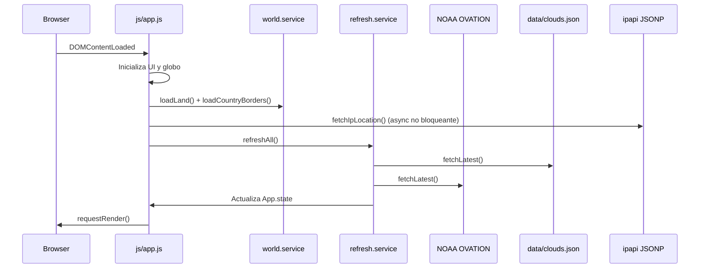
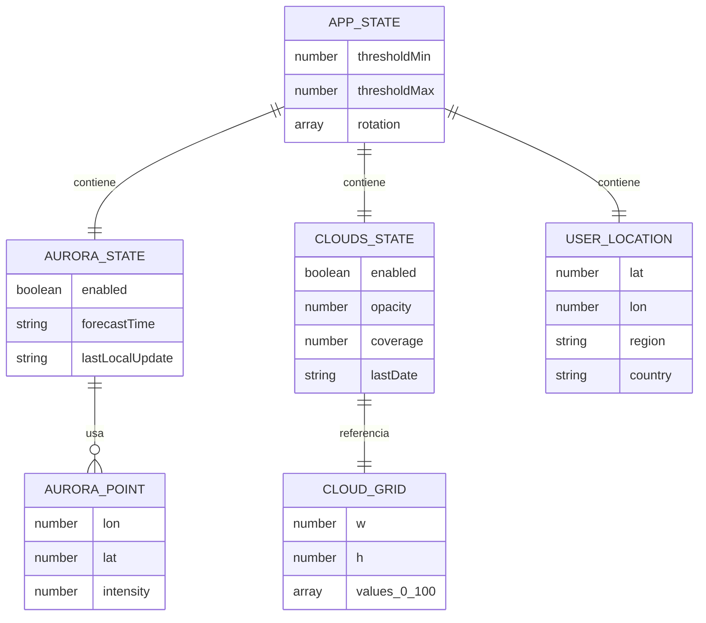
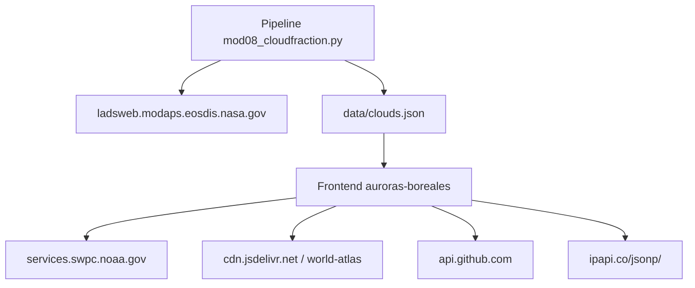

# auroras-boreales

Aplicación web estática para visualizar actividad auroral sobre un globo 3D, combinando el feed OVATION de NOAA con una capa de nubosidad procesada desde datos MODIS y una máscara dinámica de día/noche.

## Tabla de contenido
- [Arquitectura](#arquitectura)
- [Código fuente](#código-fuente)
- [Modelo de datos](#modelo-de-datos)
- [Reglas de negocio](#reglas-de-negocio)
- [Funcionalidad](#funcionalidad)
- [Integraciones](#integraciones)
- [Infraestructura](#infraestructura)
- [Seguridad](#seguridad)
- [Operación](#operación)
- [Pruebas](#pruebas)
- [Rendimiento](#rendimiento)
- [Governanza](#governanza)
- [Conocimiento](#conocimiento)
- [Evolución](#evolución)
- [Runtime](#runtime)
- [Regulatorio](#regulatorio)
- [Gestión de cambio](#gestión-de-cambio)
- [Resiliencia](#resiliencia)
- [Licenciamiento](#licenciamiento)
- [Migración](#migración)

## Arquitectura

La solución sigue una arquitectura **frontend estática modular**. No hay backend de aplicación en tiempo de ejecución: el navegador consume fuentes remotas y un artefacto local (`data/clouds.json`) previamente generado.

### Capas principales
- **Presentación:** `index.html` y `style.css` definen la shell visual, paneles laterales y canvas principal.
- **Estado compartido:** `js/state.js` centraliza umbrales, rotación del globo, selección, datos de aurora, nubosidad y geolocalización.
- **Servicios de datos:** `js/data/*.js` encapsula consumo de NOAA, archivos locales, geolocalización por IP y refresco coordinado.
- **Renderizado geoespacial:** `js/globe/*.js` y `js/overlays/*.js` pintan continentes, auroras, nubes y día/noche sobre un canvas 2D con D3.
- **Interacción/UI:** `js/ui/*.js` sincroniza sliders, toggles, paneles de inspección y metadatos de versión.
- **Preproceso offline:** `scripts/mod08_cloudfraction.py` descarga y transforma datos NASA/LAADS para producir `data/clouds.json`.

### Diagrama de arquitectura



### Flujo principal de arranque



## Código fuente

### Estructura relevante

```text
.
├── index.html
├── style.css
├── tratamiento-datos.html
├── explicacion-sitio.html
├── data/
│   ├── clouds.json
│   └── history/
├── js/
│   ├── app.js
│   ├── config.js
│   ├── events.js
│   ├── state.js
│   ├── utils.js
│   ├── data/
│   ├── globe/
│   ├── overlays/
│   └── ui/
├── scripts/
│   └── mod08_cloudfraction.py
└── versor.js
```

### Responsabilidades por módulo
- `js/config.js`: parámetros globales, endpoints, límites, opacidad, sampling y metadatos del repo.
- `js/app.js`: composición de módulos, carga de assets base y primer refresco.
- `js/data/ovation.service.js`: normaliza coordenadas NOAA y extrae `Forecast Time`.
- `js/data/clouds.service.js`: carga el artefacto local de nubosidad con `cache: no-store`.
- `js/data/refresh.service.js`: ejecuta refresco concurrente y tolera fallos parciales en nubes.
- `js/data/location.service.js`: consulta la geolocalización por IP mediante JSONP y normaliza la respuesta al estado de la app.
- `js/overlays/*.js`: renderizado de auroras, nubes y sombra nocturna.
- `js/ui/*.js`: manipulación de DOM y sincronización con estado/eventos.
- `scripts/mod08_cloudfraction.py`: pipeline offline para generar la malla global de nubosidad.

## Modelo de datos

### Estado en memoria (`App.state`)
- `thresholdMin` / `thresholdMax`: rango de intensidad auroral visible.
- `rotation`: orientación del globo.
- `aurora.points`: arreglo de puntos `[lon, lat, intensidad, cartesian]`.
- `aurora.forecastTime`: fecha/hora publicada por NOAA.
- `clouds.gridNormalized`: grid normalizado a valores `[0..1]` listo para render.
- `clouds.coverage`: porcentaje global de nubosidad.
- `selection`: punto actualmente inspeccionado, incluida su clasificación de visibilidad estimada.
- `userLocation`: localización inferida por IP.

### Feed de auroras esperado

```json
{
  "Forecast Time": "2026-03-23T00:00:00Z",
  "coordinates": [[-100.0, 65.0, 35], [-95.0, 64.5, 42]]
}
```

### Artefacto local de nubes

```json
{
  "source": "LAADS DAAC (MODIS Terra)",
  "product": "MOD08_D3",
  "collection": "61",
  "date": "YYYY-MM-DD",
  "sds": "Cloud_Fraction_Mean",
  "coverage_percent_global": 12.34,
  "grid": {
    "w": 360,
    "h": 180,
    "values_0_100": [0, 0, 5, 12]
  }
}
```

### Diagrama del modelo



## Reglas de negocio
- Solo se dibujan auroras si la capa está habilitada y el punto cae dentro del umbral configurado por el usuario.
- Se filtran puntos aurorales por latitud absoluta mínima para evitar ruido lejos de zonas polares.
- El render de auroras y nubes omite puntos que quedan “detrás” del hemisferio visible mediante producto punto cartesiano.
- La nube visible se restringe al rango seleccionado por el usuario en porcentaje normalizado.
- La geolocalización por IP es oportunista: si falla, la aplicación sigue operando.
- La probabilidad de visibilidad del punto inspeccionado se clasifica con una matriz simple: `Alta` si la intensidad es `>= 70` y la nubosidad `<= 30%`, `Media` si la intensidad está entre `30` y `60` con nubosidad `<= 30%`, y `Baja` en cualquier otro caso.
- El refresco de datos acepta degradación parcial: si falla nubosidad, la app puede seguir mostrando auroras.
- `clouds.json` se considera una instantánea diaria/preprocesada, no una fuente en vivo de alta frecuencia.
- La versión visual expuesta al usuario corresponde a la fecha del último commit de la rama configurada en GitHub.

## Funcionalidad
- Visualización del globo interactivo con arrastre y selección de puntos, ajustada al alto útil del panel principal.
- Activación/desactivación de capas de aurora, nubosidad y máscara día/noche.
- Ajuste de umbrales de intensidad auroral y nubosidad mediante sliders dobles.
- Panel de detalle del punto seleccionado con latitud, longitud, intensidad, nubosidad, condición día/noche y probabilidad de visibilidad estimada.
- Panel de localización inferida por IP.
- Panel de estado con versión y última actualización de datos.
- Página secundaria `tratamiento-datos.html` con documentación de fuentes y tratamiento.
- Página secundaria `explicacion-sitio.html` que consolida la explicación ejecutiva y académica del proyecto a partir del README y los materiales de la carpeta `presentaciones/`.

## Integraciones

### Externas
- **NOAA SWPC:** feed JSON `ovation_aurora_latest.json`.
- **world-atlas / jsDelivr:** topología mundial para masa continental y fronteras.
- **GitHub API:** consulta del commit más reciente para mostrar la versión visible.
- **ipapi (`/jsonp/`):** estimación geográfica por IP consumida desde el navegador mediante JSONP.
- **NASA LAADS / Earthdata:** origen del dataset MODIS procesado offline.

### Diagrama de integraciones



## Infraestructura
- **Hosting objetivo:** sitio estático, compatible con GitHub Pages o cualquier servidor HTTP simple.
- **Dependencias runtime del navegador:** D3 v7, TopoJSON Client y `versor.js` cargados por script tag.
- **Dependencias del pipeline offline:** Python, `requests`, `numpy`, `pyhdf` y un token `EARTHDATA_TOKEN`.
- **Persistencia:** archivos versionados en Git (`data/clouds.json` y, si se conservan localmente, históricos bajo `data/history/`).
- **Red de entrega:** endpoints públicos HTTPS y contenido estático servido por CDN o repositorio.
- **Empaquetado de Pages:** el workflow de despliegue publica un bundle curado que excluye artefactos recolectados bajo `data/history/`.

## Seguridad
- No existe autenticación ni manejo de cuentas de usuario en la aplicación web actual.
- La localización es aproximada y basada en IP, sin captura obligatoria de geolocalización precisa del navegador.
- El token de Earthdata solo debe utilizarse en el pipeline offline y nunca exponerse al frontend.
- La app depende de orígenes externos; conviene endurecer la política de contenido (`CSP`) si se despliega en producción propia.
- El proyecto debe revisar periódicamente que URLs externas, esquemas JSON y dependencias CDN no cambien de forma incompatible.

## Operación

### Ejecución local
```bash
python -m http.server 8000
```
Luego abrir `http://localhost:8000`.

### Actualización de nubosidad
```bash
EARTHDATA_TOKEN=*** python scripts/mod08_cloudfraction.py
```

### Operación diaria recomendada
1. Generar o actualizar `data/clouds.json` desde el pipeline de nubosidad cuando corresponda.
2. Verificar que el feed NOAA responde y que el frontend carga las capas en vivo.
3. Publicar cambios estáticos en la rama servida, sabiendo que GitHub Pages excluye `data/history/` del artefacto desplegado.
4. Revisar `tratamiento-datos.html` y `README.md` cuando cambien fuentes, reglas, pipelines o endpoints.

## Pruebas
Actualmente el repositorio no define una suite automatizada formal. La validación operativa recomendada es:
- Servir el sitio localmente y revisar que el canvas renderiza sin errores en consola.
- Confirmar que el refresco actualiza auroras aunque falle la fuente de nubes.
- Probar cambios de umbrales y toggles en desktop y móvil.
- Verificar que `scripts/mod08_cloudfraction.py` produce un `clouds.json` válido.
- Revisar manualmente que `tratamiento-datos.html`, `README.md` y `AGENTS.md` sigan alineados.

## Rendimiento
- Se limita la densidad de puntos renderizados por `sampleStep`/`auroraStep` según el tamaño del viewport.
- Se topa el device pixel ratio (`dprMax`) para evitar sobrecoste en pantallas densas.
- Se usa caché de malla de nubes (`gridCache`) para no recalcular puntos en cada frame.
- El grid de nubes se transporta como arreglo plano compacto `values_0_100`.
- La geolocalización y consulta de versión no bloquean el render principal.

## Governanza
- El repositorio se rige por documentación viva: `README.md` para visión integral y `AGENTS.md` para bitácora operativa.
- Toda modificación funcional debería dejar evidencia en archivos de documentación cuando afecte arquitectura, reglas, fuentes o operación.
- La rama y repositorio configurados en `js/config.js` son referencia de la versión mostrada al usuario, por lo que deben mantenerse coherentes con el despliegue real.

## Conocimiento
- El dominio principal combina geovisualización, clima espacial y nubosidad satelital.
- La página `tratamiento-datos.html` documenta privacidad, fuentes y procesamiento orientado al usuario final.
- `AGENTS.md` conserva decisiones, aprendizajes, riesgos y próximos pasos para mantener continuidad de trabajo.
- Los datos históricos bajo `data/history/`, si se conservan en el repositorio o en copias locales, sirven como base de análisis y respaldo pero ya no forman parte del despliegue público.

## Evolución
Áreas naturales de evolución:
- Incorporar tests automatizados para normalización y utilidades de grid.
- Separar más claramente la capa de dominio de la de renderizado.
- Versionar explícitamente snapshots de nubes y auroras en UI.
- Añadir observabilidad básica de fallos de endpoints externos.
- Evaluar migración de módulos IIFE a ES Modules o TypeScript.

## Runtime
- **Navegador:** aplicación SPA ligera basada en scripts globales y canvas.
- **Entorno de script:** Python para generación offline de artefactos de nubosidad.
- **Frecuencia de refresco visual de día/noche:** cada 60 segundos por defecto.
- **Refresco de datos:** manual vía botón y al cargar la aplicación.

## Regulatorio
- El proyecto debe mantener transparencia sobre fuentes de datos, finalidad y tratamiento en `tratamiento-datos.html`.
- La geolocalización por IP debe comunicarse como aproximada y no determinística.
- Si el despliegue incorpora analítica, cookies u otros identificadores, la documentación regulatoria deberá ampliarse.
- Se recomienda mantener trazabilidad entre documentación pública y endpoints reales configurados.

## Operación de workflows
- Los workflows `Collect OVATION Snapshots` y `Build OVATION Global Merge` se retiraron el **23 de marzo de 2026** porque la aplicación ya consume OVATION directamente desde NOAA en tiempo real y no requiere recolectar snapshots ni consolidarlos.
- El único artefacto recolectado que permanece operativo para el frontend es `data/clouds.json`, generado por el workflow de MODIS.
- El despliegue de GitHub Pages empaqueta una carpeta `dist/` y excluye `data/history/` para evitar publicar históricos o derivados de recolección.

## Gestión de cambio

- La documentación visible del sitio debe mantenerse alineada entre `README.md`, `tratamiento-datos.html`, `explicacion-sitio.html` y los materiales base en `presentaciones/`.

- Cualquier cambio en arquitectura, fuentes, endpoints, reglas de negocio, operación o cumplimiento debe reflejarse en `README.md`.
- Cualquier cambio relevante de contexto, decisiones, pendientes o riesgos debe registrarse en `AGENTS.md`.
- Cuando una actualización toque documentación de tratamiento, también debe revisarse la coherencia entre `README.md`, `AGENTS.md` y `tratamiento-datos.html`.
- Los cambios de infraestructura o integración deberían incluir un diagrama Mermaid actualizado cuando alteren el flujo actual.

## Resiliencia
- El refresco usa `Promise.allSettled`, lo que permite tolerar fallos parciales.
- La geolocalización por IP usa `ipapi.co/jsonp/` para evitar depender de CORS en el navegador.
- La UI mantiene funcionalidad básica aun sin `clouds.grid`, mostrando al menos cobertura global cuando existe.
- El sombreado día/noche se recalcula localmente sin depender de APIs externas una vez cargada la app.

## Licenciamiento
Este repositorio no declara todavía una licencia explícita en un archivo dedicado. Antes de uso externo amplio o contribuciones abiertas, conviene:
- definir una licencia del código,
- revisar compatibilidad de datos y dependencias externas,
- documentar restricciones de uso de fuentes NOAA, NASA/LAADS y servicios de terceros.

## Migración
Posibles rutas de migración futura:
- **A módulos ES / bundler:** para mejorar mantenibilidad y testing.
- **A TypeScript:** para reforzar contratos de datos y estado.
- **A backend liviano opcional:** si se requiere cachear integraciones o proteger secretos.
- **A pipeline CI/CD:** para regenerar `clouds.json`, validar documentación automáticamente y empaquetar el sitio con exclusiones explícitas de artefactos recolectados.

### Consideraciones para migrar
- Conservar el contrato de `App.state` o introducir una capa adaptadora.
- Mantener compatibilidad del esquema de `data/clouds.json` hasta versionarlo.
- Asegurar que el nuevo runtime no rompa la carga por GitHub Pages si ese sigue siendo el target.
